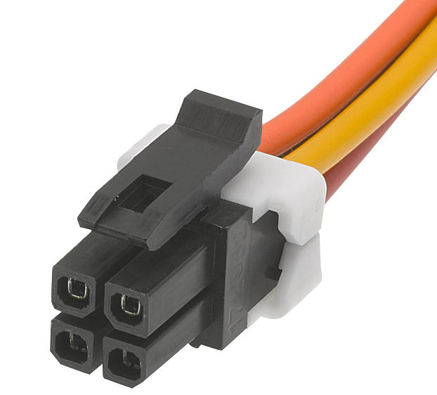
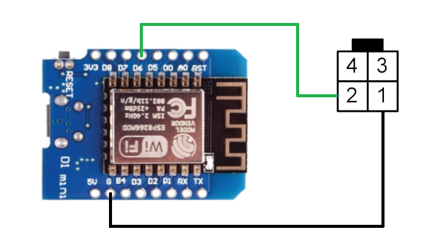
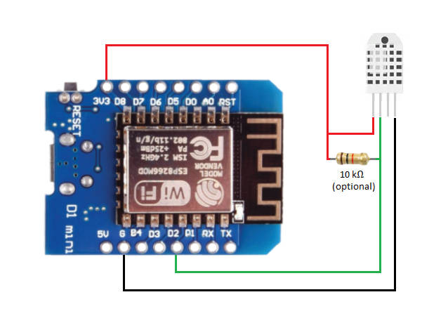

# Frisquet Boiler Thermostat
#### A virtual thermostat to connect a standard boiler to the magic world of IoT

This project intends to control an old Frisquet boiler (Eco Radio System) by connecting it to the network, using [ESPHome] on an ESP8266 (or any other ESPHome compatible) microcontroller.
The boiler is then seen as a connected thermostat via MQTT or directly on a [Home Assistant] server instance.

## References
It is highly inspired from a fantastic "Frisquet hacking" thread and related projects (mostly in french) :
- The thread that made all this possible :
  - [Régulation d'une chaudière Frisquet ECO radio System](https://www.easydomoticz.com/forum/viewtopic.php?t=1486) - 
- A step-by-step reverse engineering of the communication protocol used by the boiler :
  - [Décodage du signal Frisquet Eco Radio System](https://antoinegrall.wordpress.com/decodage-frisquet-ers/) - 
- An implementation of the communication protocol used by the Frisquet boiler (Arduino IDE), very useful to get your boiler "ID" (needed to drive the boiler) :
  - https://github.com/etimou/frisquet-arduino
- A RFLink variant :
  - https://github.com/ChristopheHD/frisquet-arduino
- A well-documented ESPhome project :
  - [philippemezzadri]

> THANK YOU, GUYS, FOR YOUR WORK !

## Features
This program is able to :
- Expose a virtual thermostat that represents the boiler on the wifi network
- Regulate the boiler power using a PID controller
- Send setpoints to the boiler using a direct wired connection
- Handle network and client failures to keep the boiler in a secure state

> NOTE: This program needs to get the current temperature from a sensor, so a pre-requisite is a temperature sensor installed on your Home Assistant instance.

## Tech and dependencies
This app uses a number of tech and projects to work properly:
- [ESPHome] - Control your ESP8266/ESP32 by simple yet powerful configuration files and control them remotely through Home Automation systems
- [MQTT] - The Standard for IoT Messaging
- [Home Assistant] - Open source home automation that puts local control and privacy first

## Wiring
> This section is taken from [philippemezzadri]'s project readme.

The ESPHome replaces the original Eco Radio System HF receiver and is connected to the boiler main board through a micro-fit 4 socket.

| ESP board             | Boiler Side         | Pin number |
| --------------------- | ------------------- |:----------:|
| GND                   | black wire          | 1          |
| Pin D6 (configurable) | yellow wire         | 2          |
| 5V                    | red wire (optional) | 3          |

**Micro-fit 4 pin out and connector :**

  
  

Defined viewing direction for the connector pin out:

- Receptable - _rear view_
- Header - _front view_

**Wiring on a D1-mini / NodeMCU board :**

## Installation
- You must get your boiler ID using the frisquet-ERS-decode.ino sketch available here : https://github.com/etimou/frisquet-arduino
>The idea is to capture data frames coming from the official remote, and decode them to extract your boiler ID.
The wiring is the same, except that the ESP8266 is connected to the antenna connector instead of the boiler connector.
- Rename secrets_example.yaml to secrets.yaml
- In secrets.yaml file :
  - Fill in the `boiler_id` field with the value you found in previous step
  - Get a random API encryption key from [Native API Component] and update the `api_encryption_key` field
  - Update the value of all the other fields
- In frisquet_boiler.yaml file :
  - Indicate your board name in `esp8266/board`. Mine is a Wemos D1 mini clone (ESP8266 12F) known as nodemcuv2
  - Set `sensor/entity_id` with the id (in home assistant) of the temperature sensor you want to use to drive the boiler with. It is advised to use a sensor that quickly reacts upon any change of room temperature. The most efficient is to build your own (see chapter `Build your own temperature sensor` below)
  - In case the control PIN you chose on the ESP board is not D6, then change the value of the `output/pin` field
- compile and upload the firmware from `frisquet_boiler.yaml` using ESPHome

## Build your own temperature sensor
- To understand the wiring, you can refer to https://lastminuteengineers.com/esp8266-dht11-dht22-web-server-tutorial/
On my D1 mini, using D2 PIN, the wiring is :

>The sensor is an AM2302 (DHT22 type). It is more acurate than a DHT11, and it supports either 3.3v or 5v.
You can use a 10k resistor if sensor readings are eratic or unstable
- To make the sensor available in Home Assistant, simply use the ESPHome example in folder `./temp-sensor-example`:
  - Rename `secrets_example.yaml` to `secrets.yaml`
  - Customize values in `esphome.yaml` and `secrets.yaml`

[//]: # (These are reference links used in the body of this note and get stripped out when the markdown processor does its job. There is no need to format nicely because it shouldn't be seen. Thanks SO - http://stackoverflow.com/questions/4823468/store-comments-in-markdown-syntax)

  [ESPHome]: <https://esphome.io/>
  [mqtt]: <https://mqtt.org/>
  [Home Assistant]: <https://www.home-assistant.io/>
  [philippemezzadri]: <https://github.com/philippemezzadri/frisquet-esphome>
  [Native API Component]: <https://esphome.io/components/api.html>
